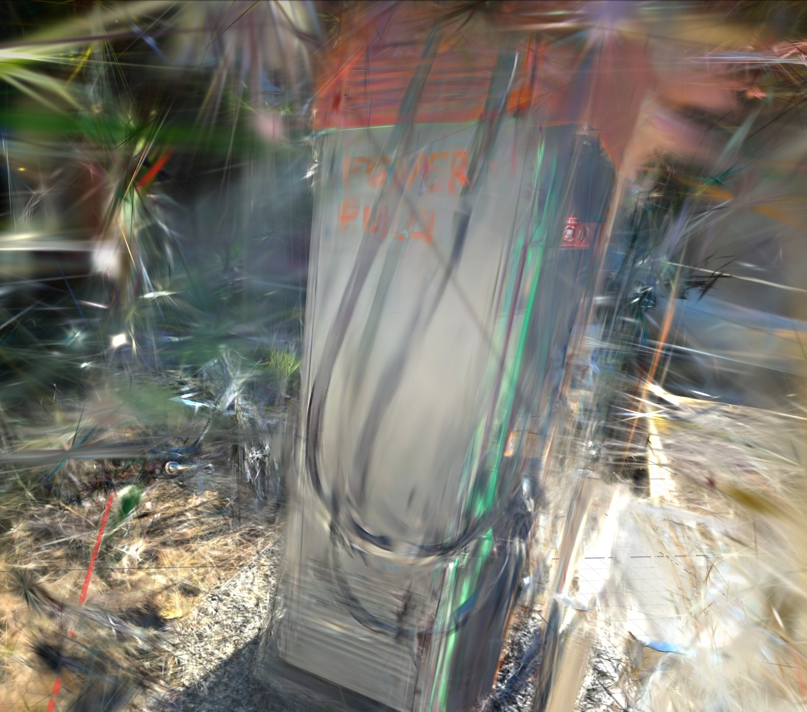
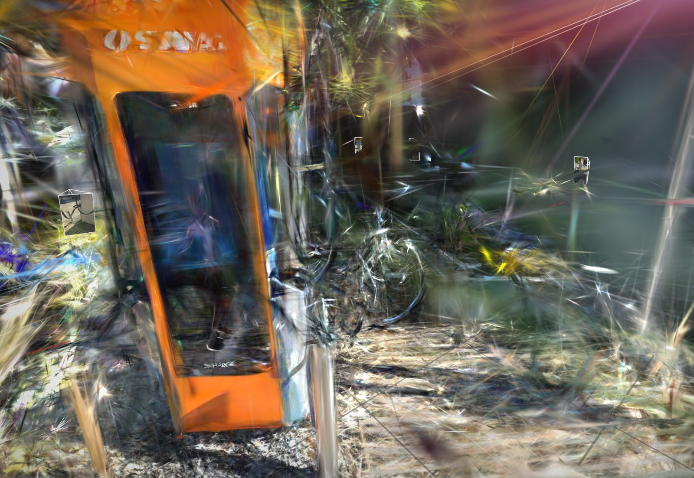
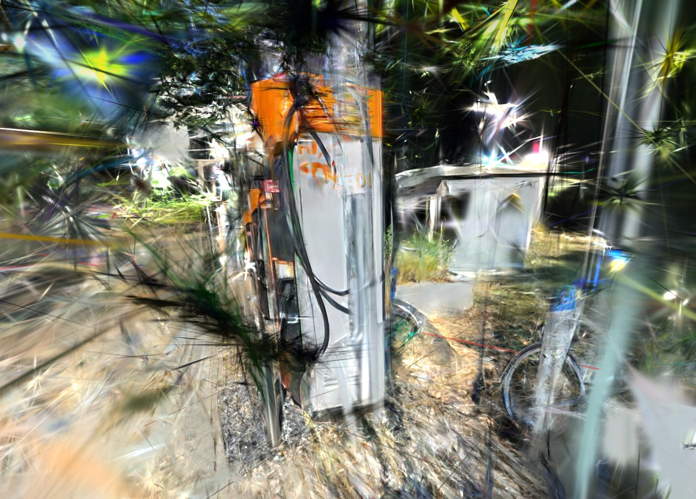
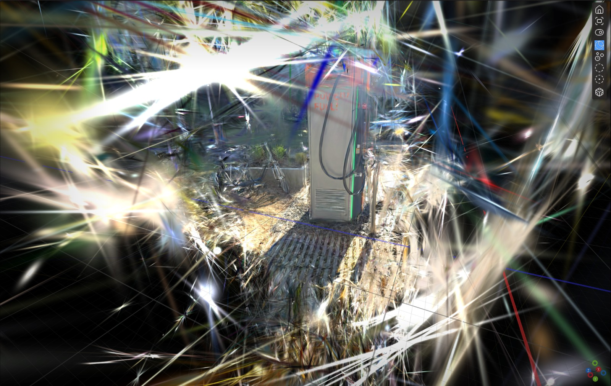
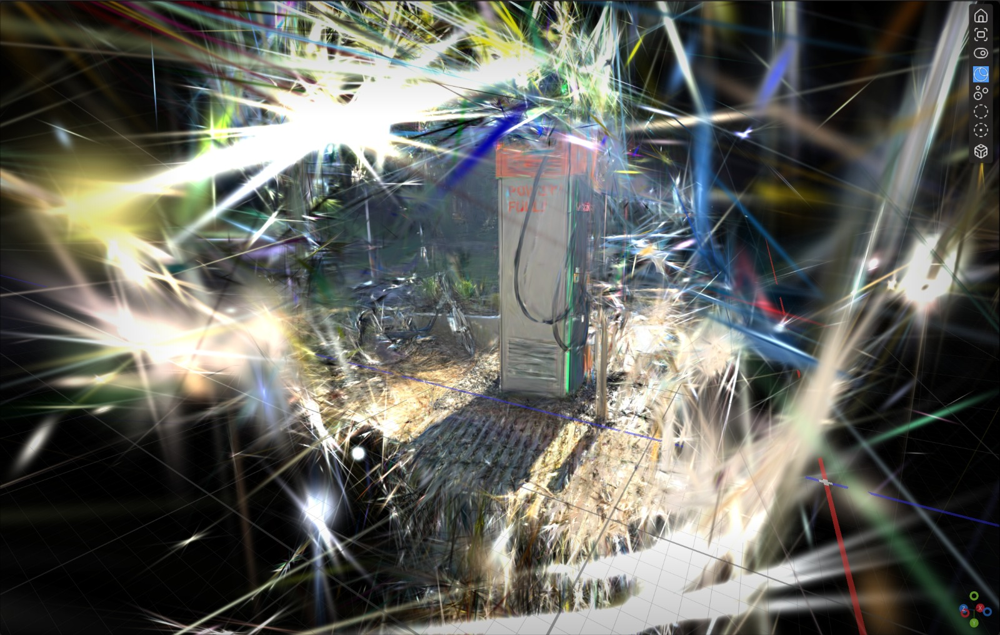
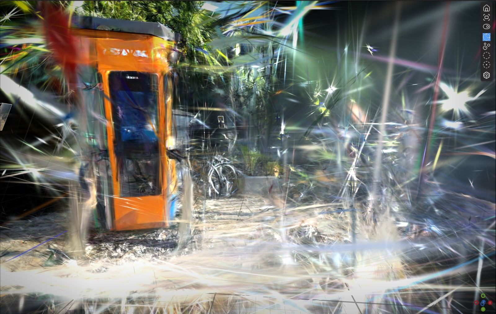
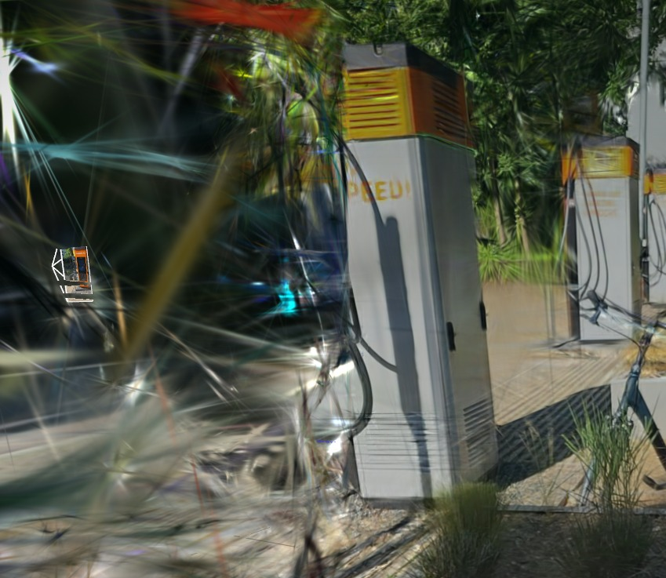

# Task 1 review

Date: 11.07.2026

Notes: first gaussian splat rendering of the 2 provided zip files (electromobil station)

## 1. Training result: 2026-07-09_15-47-48utc

Final error: 0.0282 (mathematically very low)

We started the review from the second training result because it was significantly worse in quality. Therefore, I advise to read the second one first.

Problems appeared: ghosted/smeared/doubled appear

### Photo 5

Note: Now this becomes interesting. For this render we had several cameras with provided images. The picture still remains blurry and ghosting from some angles. Now we can suspect that there might be a technical issue when trying to merge all the views.

Cause: We suspect a technical issue with coordinates/angles here.

Screenshot:

How to solve: not yet decided

### Photo 6

Note: In this picture we see a render from the front made out of a single picture that had good quality. This, to some extend, proves our theory from Photo 5, although the render still isn't clear enough. We will try to explore this in the future.

Cause: ???

Screenshot:

How to solve: ???

### Photo 7

Note: We did spot visible ghosting from the side and a lot of noise around the edges. The cable looks also doubled in some places. We also get a lot of floating splats around the object.

Cause: It was probably caused by a bad overlap of images. A more detailed and consistent capture should do the job.

Screenshot:

How to solve: Consistent capture

## 2. Training result: 2026-07-09_15-46-36utc

Final error: 0.0434

Problems appeared: ghosted/smeared/doubled appear

### Photo 1

Note: Good render from the front. Main object is visible and the charging station shape is understandable. Still some noisiness especially around the object. The ground is rendered alright, but there are floating splats.

Cause: This angle had better coverage - object was visible throughout circa 6 photos. The surrounding noise is probably from bad poses, reflections or vegetation. Lighting could have also been an issue.

Screenshot:

How to solve: More stable circle around the object with slower movement. Definitely a stable pivot on the y-axis during capture, so the background becomes less noisy.

### Photo 2

Note: Basically photo 1 from the side. The main station is still visible, but the pipes/cables are ghosted and partially floating. Small, thin floating objects like pipes seem to be a problem - ghosting/doubled.

Cause: Thin objects are harder to render out and probably did not have enough various views. Could also be pose inconsistency from this side.

Screenshot:

How to solve: More side photos, especially when trying to capture smaller 3D objects with unusual geometry.

### Photo 3

Note: Orange station/object is rendered quite good, but the text isn't readable - smearing/ghosting in the middle and around the text.

Cause: Text is a small detail and probably gets lost easily. Could also be caused by pose inconsistency, motion blur or too low frame density.

Screenshot:

How to solve: More close but stable photos of the text side. In this case maybe a circular capture would render the text better. The frame consistency should be the main priority.

### Photo 4

Note: The main powerstation frame is mostly visible, but there is a clear issue with the surrounding left side. Almost the entire part is smeared and blurred out. Could be a technical issue where the coordinates didn't quite fit right because it just looks weird.

Cause: Probably weaker coverage from this angle or bad alignment between views. The side/background seems to confuse the entire render.

Screenshot:

How to solve: Capture in full circle more evenly, with the same height.

### Note

Worse than the first one. The size of this zip is also smaller.

Guess: the frame rate of the record is too low. There is probably not enough overlap between the photos and this causes ghosting/smearing/doubling, especially for small objects like pipes, cables, text and thin frames.

## Progress

Task 1 kind of finished. Both toolchain smoke-tests succeed.

## Questions

1. In `images.txt` the images begin to be quoted since the second one. WHY???
2. How does the `TRACK[]` feature tracks in `points3D.txt` work? Why are there no feature tracks?
3. What exactly does the mathematical error mean in correlation to quality of the rendered splat?
4. Can the final error be low even if the splat visually has ghosting/smearing/doubling?

## Task status

Waiting for review.

## LichtFeld-Studio version used

v0.4.2

## Other notes

This dataset is useful for Task 2 because the pipeline works and the object is recognizable, but there are still visible issues.

My doubt (Filip): we mainly described the "good manners" of the capture process in order to get a better splat in the end. I do not really know what the technical improvement for the part 2 might be.